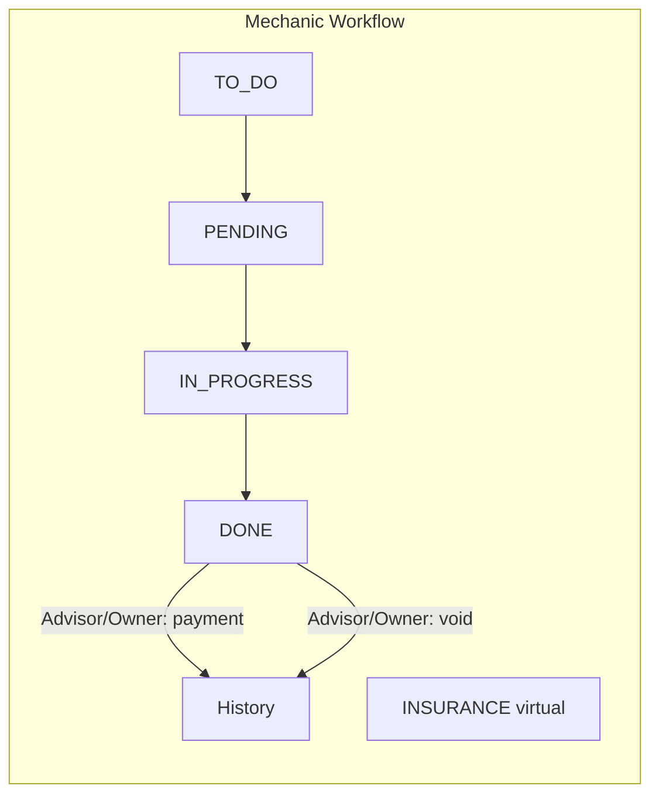

# CK-Flow 2.0 — Workflows

This document defines the workflow rules for backend implementation and frontend consistency. It does not specify implementation details.

---

## 1. Archive / History Definition (Scheme A)

- **History** is not a separate status. It is a **query view**.
- **Archive condition:** `status = DONE` AND `payment_status IN ('paid', 'voided')`.
- The backend does **not** store an `ARCHIVED` status; it stores `status = DONE` and `payment_status` (e.g. `paid | voided | null`).
- The frontend may keep an "Archive" / "History" view and treat records that satisfy the above condition as archived for display (optionally mapping them to a local `ARCHIVED` label in the UI).

---

## 2. Mechanic Shop Workflow

### 2.1 Status flow

- **Kanban statuses:** TO_DO → PENDING → IN_PROGRESS → DONE.
- **INSURANCE** is **not** a status. It is a **virtual column**: a filtered view of orders where `is_insurance_case = true`. Those orders appear in both the INSURANCE column and their actual status column.
- After **DONE**, the order is in "Finalize & Collect". Only after payment is completed (or voided) does it qualify as **History** (see §1).

### 2.2 Who can do what

| Action | Advisor | Foreman | Owner |
|--------|---------|---------|-------|
| Create Repair Order | ✓ | — | ✓ |
| Change RO status | ✓ | ✓ | ✓ |
| Upload attachments | ✓ | ✓ | ✓ |
| Send messages | ✓ | ✓ | ✓ |
| **Assign / remove Bay** | — | ✓ | ✓ |
| **Finalize payment / void** | ✓ | — | ✓ |

- **Advisor:** Cannot assign bays.
- **Foreman:** Cannot finalize payment.
- **Owner:** Full access to all operations.

### 2.3 Bay logic

- A **Bay** is an active work slot.
- Moving an RO into a Bay **starts** time tracking; removing it or changing status **stops** it.
- An RO can occupy **at most one** Bay at a time.

---

## 3. Body Shop Workflow

- **Status order (for display):** DONE, TO_DO, BODY_WORK, PAINTING, FINISHING_UP, MECHANIC_WORK.
- Currently **Owner-only**. If more roles are added later, the permission matrix must be extended in SYSTEM_RULES and here.

---

## 4. Event Log Rules

- Every state change must produce an **EventLog** entry (e.g. status change, bay assignment, payment recorded, attachment uploaded).
- **EventLog** is append-only and immutable.
- The **backend** writes EventLog entries when processing actions; the frontend only sends business actions (e.g. "set status to DONE", "assign bay"), and does not write log entries directly to the backend.

---

## 5. Backend Alignment Checklist

| Topic | Rule |
|-------|------|
| Archive / History | Query: `status = DONE` AND `payment_status IN ('paid','voided')`. No separate ARCHIVED status. |
| Event log | Backend writes EventLog on every relevant change; frontend sends actions only. |
| Permissions | Backend must enforce role checks (e.g. Advisor cannot assign bay; Foreman cannot settle payment). |
| Realtime | Subscribe per RO or per shop: new message, status change, bay change, payment update, attachment upload. |
| AI | OpenAI API via Vercel Serverless (`/api/ai/diagnostic`, `/api/ai/decode-vin`); frontend only calls these APIs; no API keys in frontend. |
